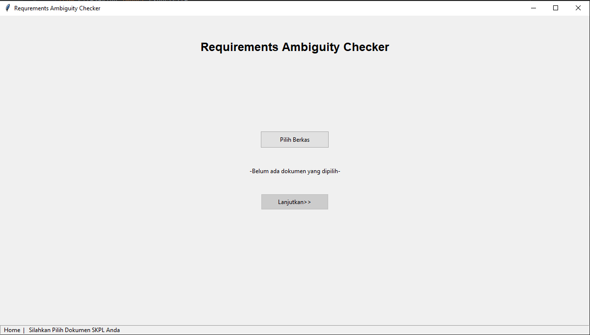
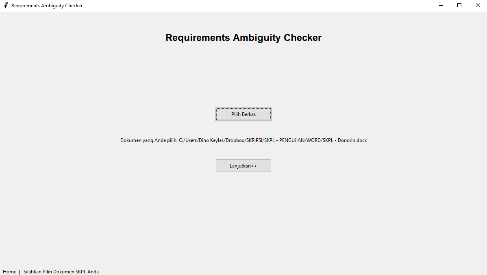
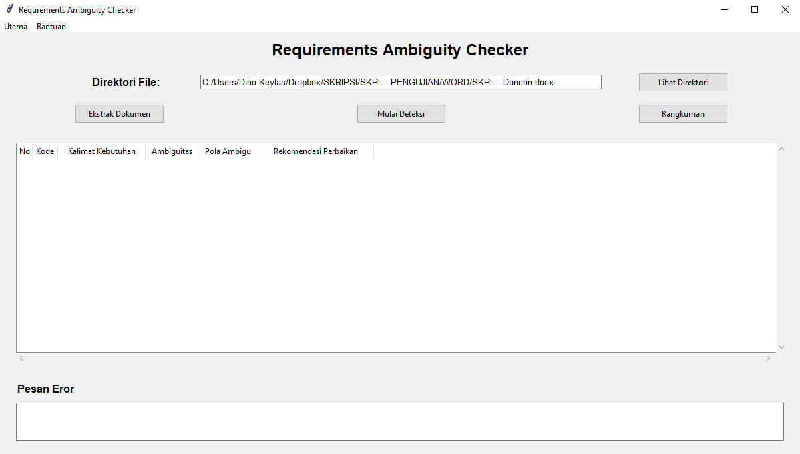
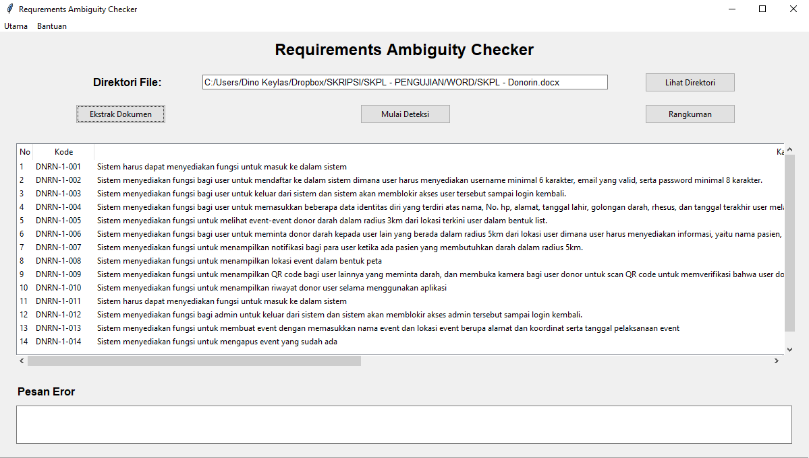
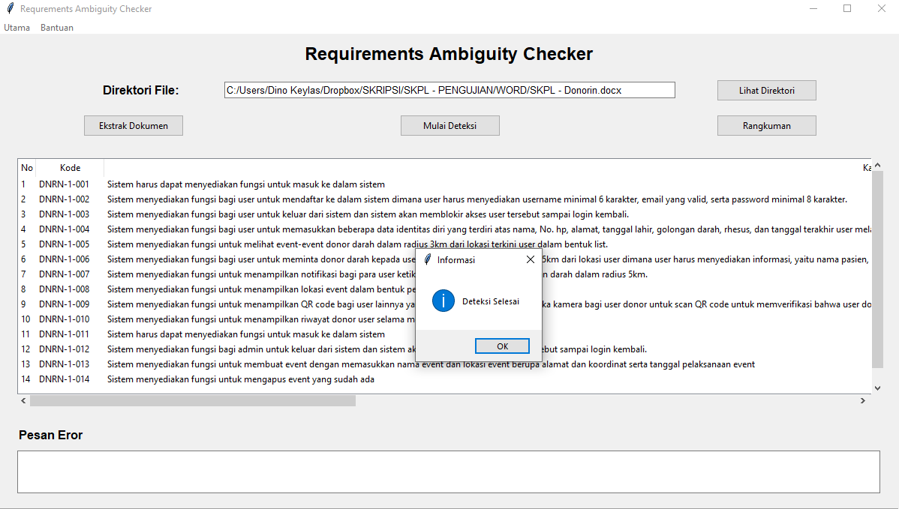
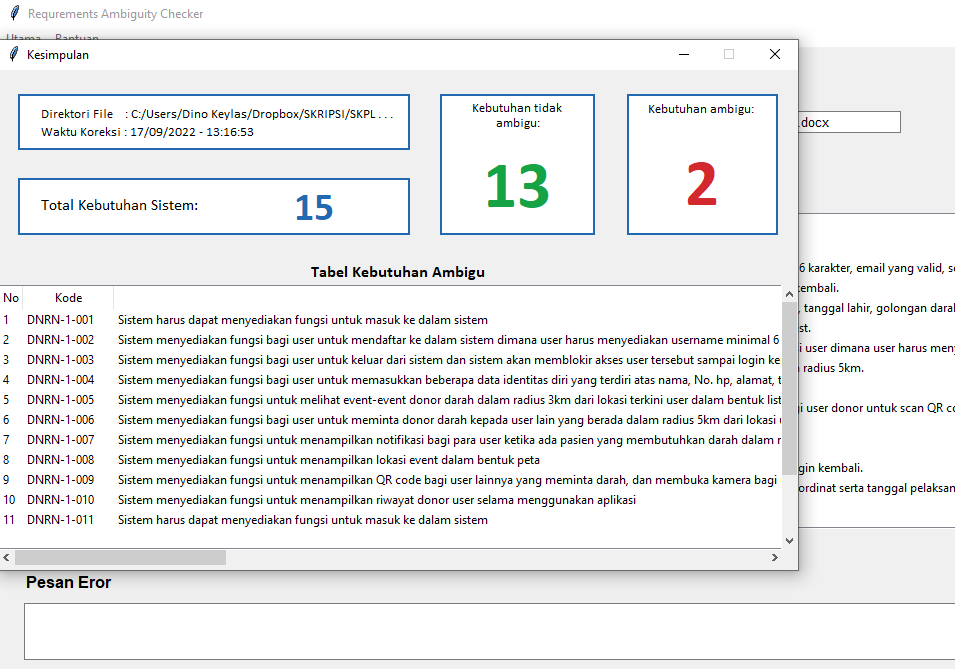
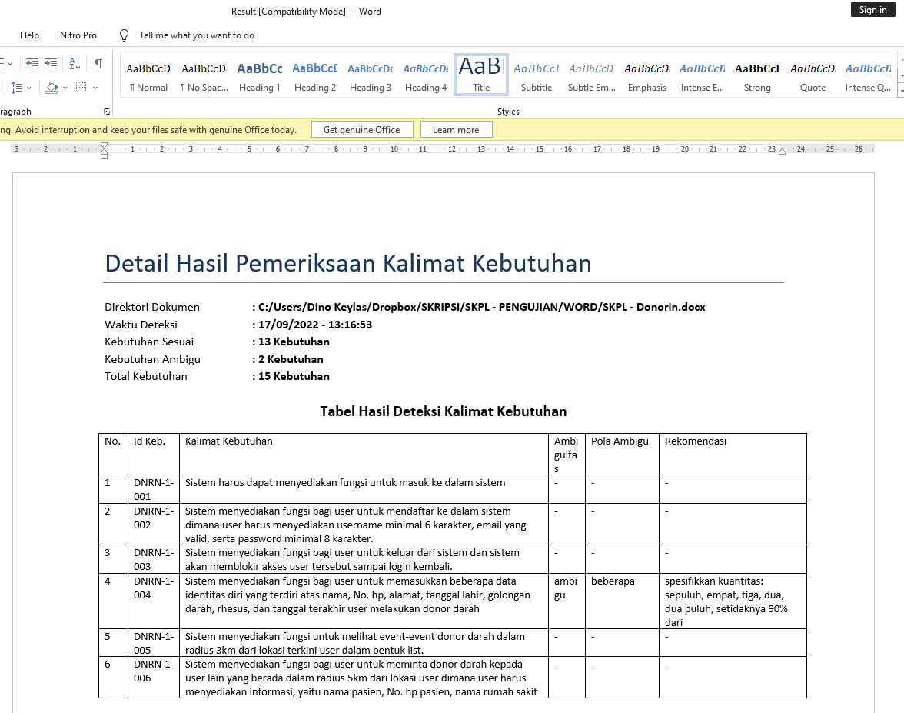

## How to Use This Program

**Note**: The document that you can import to this program is **Software Requirements Specification (SRS)**, 
in Indonesia we defined is as **Spesifikasi Kebutuhan Perangkat Lunak (SKPL)**. If you import other file, this program won't work

Below is steps to use Requirement Ambiguity Checker

1. At the home screen select the document first by click "**Pilih Berkas**"

2. After select the document, click "**Lanjutkan>>**"

3. Now, you are in the main screen, first you need to do is extract the document by clicking "**Ekstrak Dokumen**" Button.
It will only extract the '**software requirement sentences**' from your document.

 

4. After extracting process done, you can start analyzing the document by clicking "**Mulai Deteksi**" Button. 
It will take times (depend on how many sentences you have). After it done, it will show message.

 
5. Now, you can see the summary of analyzed result, just click "**Rangkuman**" Button.

6. You can export the result if you want, just go "**Utama**" Menu and click "**Rilis Hasil Deteksi**".
The export result my looks like:
